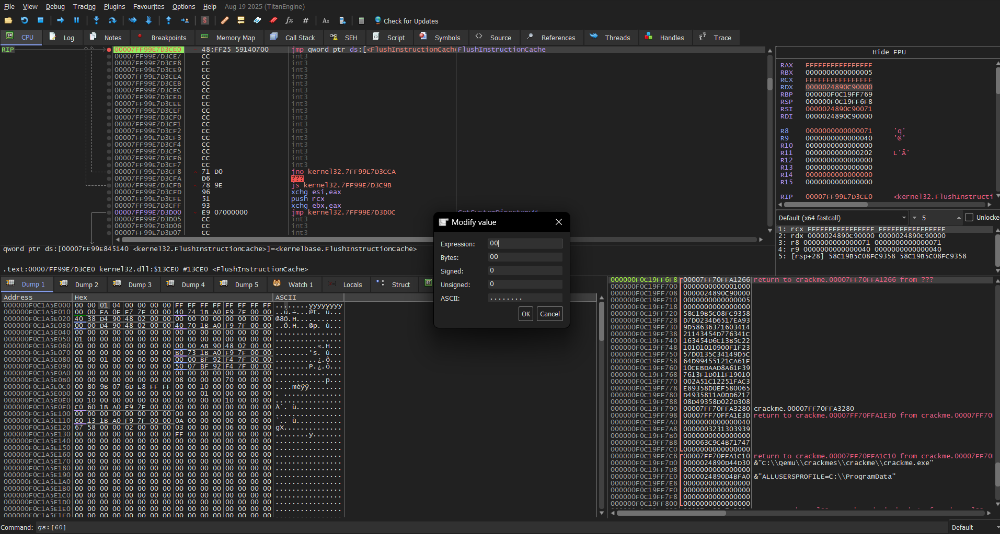
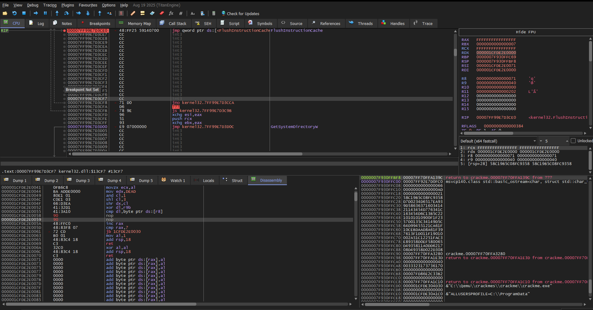

# Crackme #1 – Runtime-Decrypted XOR Password Check

This crackme dynamically decrypts its password verification routine at runtime and checks user input using an XOR-based algorithm. Unlike simple static password checks, the program dynamically allocates memory for the password validation function and decrypts it when running, making static analysis alone insufficient. It also includes anti-debugging mechanisms, requiring careful debugging and memory inspection.

## Anti-Debugging & Runtime Protections

While analyzing with **x64dbg**, the binary was observed to:

- Use `VirtualProtect` to mark dynamically allocated memory as executable after decryption.  
- Call `IsDebuggerPresent` and perform **PEB-based inspections** to detect debuggers.  

These techniques are common in packed binaries and malware to prevent easy analysis.



## Runtime-Decrypted Function

The decrypted function performs the password verification. Key points:

- Requires **exactly 7 characters** of input  
- Builds the target string `"pass123"` on the stack  
- Applies **XOR-based transformations** using a key (`0xDEAD`)  
- Compares each byte of input to the transformed bytes  

Simplified pseudo-code:

```c
for (int i = 0; i < 7; i++) {
    transformed = input[i] XOR key[i];
    if (transformed != pass[i]) {
        return false;
}
return true;
```

Because XOR produces non-printable bytes, entering the correct password via terminal is impossible. The transformed bytes do not correspond to standard ASCII characters.

## Patch Strategy

The instruction responsible for jumping to the failure path was:

```
75 10    jne failure
```

This conditional jump sends the program to the "wrong password" routine if the comparison fails. To bypass it, we patched the instruction to:

```
90 90    nop nop
```

Explanation of the patch:

- `90` is the NOP (No Operation) instruction in x86 assembly
- Replaces `jne failure` with two NOPs, disabling the jump
- Forces the function to always return success

After the patch, any 7-character input is accepted

Result: The program skips the failure path and reaches the "Correct!" message.

## Screenshots

### Original Encrypted Instruction


### Patched Instruction



## Result

After patching:

- Program reaches the success path
- Displays the message "Correct!"
- Demonstrates bypassing anti-debugging and runtime protections

## Tools Used

- **x64dbg** — Debugging and memory inspection
- **Hex editor / Assembler view** — Modifying instructions in memory
